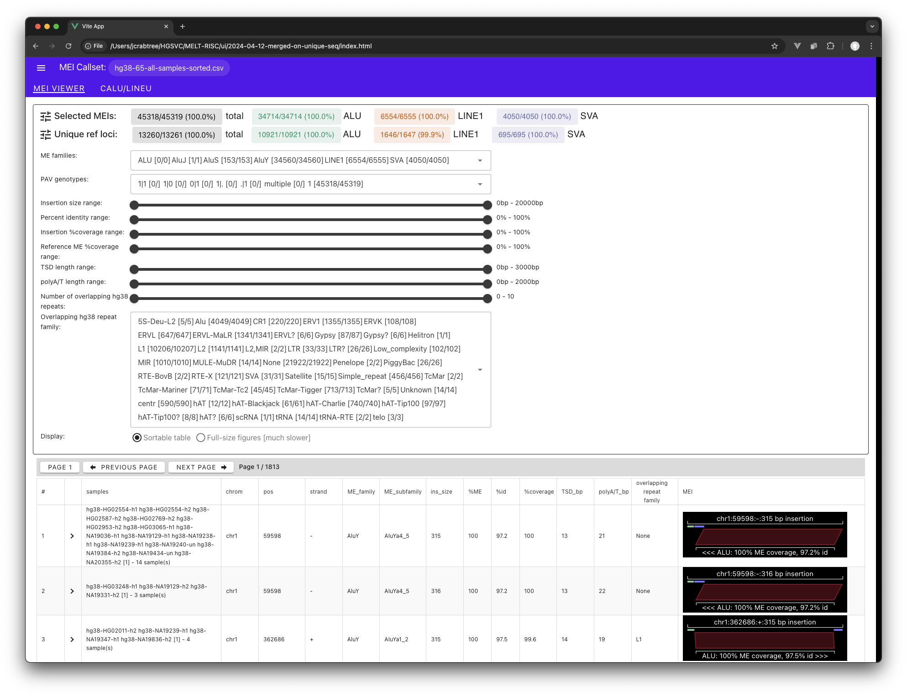
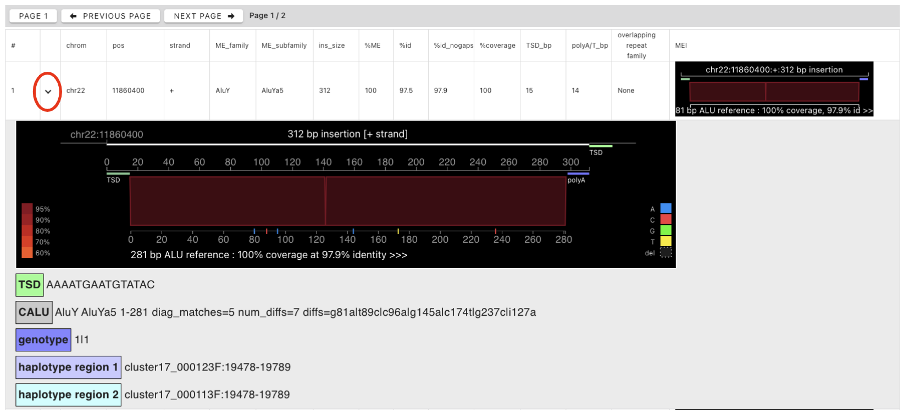
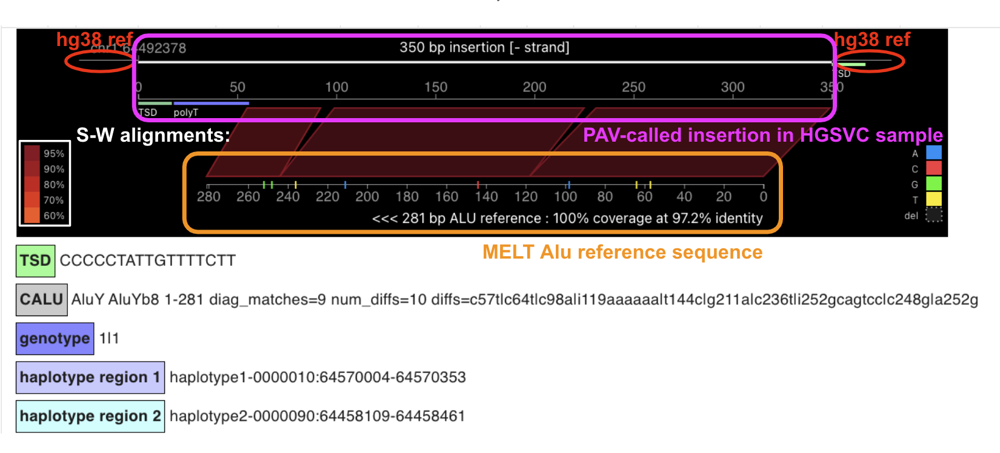
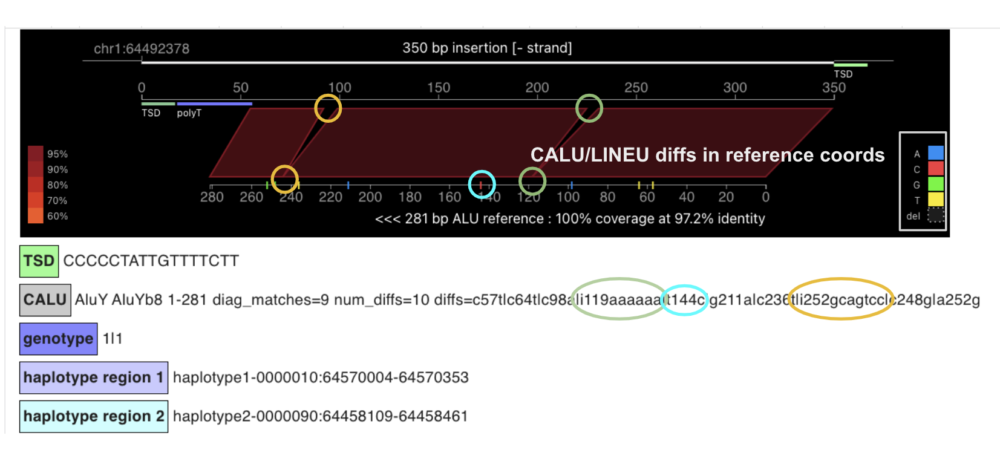

# Mobile Element Locator Tool - Long Read Asssembly (MELT-LRA)

MELT-LRA takes as input a set of [PAV](https://github.com/EichlerLab/pav)-generated variant
calls (i.e., insertions or deletions) and produces as output the subset of those variants
that appear to correspond to known Mobile Element Insertions (MEIs), annotated with the
evidence for those assertions.

## MELT-LRA output

MELT-LRA produces output in the following formats:

 - VCF
 - Ad-hoc CSV (comma separated value)
 - ASCII art

For example, here is the MELT-LRA ASCII art renditiion of a single MEI call, an Alu on chromosome 1 (scroll right to see the entire MEI call):

```
Location        |ME   |+/-|%ME   |%id   |%cov  | insertion
chr1:710579     |ALU  |+  |100.0%| 97.9%| 86.5%| atactgctat [AAAGAACTGCCCGGCCGGGCGCGGTGGCTCACGCCTGTAATCCCA....+234bp....CGAGACTCCGTCTCAAAAAAAAAAAAAAAAAAAAAAAAAAAAAAA] aaagaactgcccaagactgggtaatttata
                                                             <---TSD---->                                                             <------------polyA------------>  <---TSD---->
                                                                         [ALU-----------------------------              ----------ALU>                               
```


## MEI Viewer

MELT-LRA includes an interactive MEI Viewer implemented using [VueJS](https://vuejs.org/).
The viewer reads and displays MELT-LRA output in both tabular and graphical form. The viewer
allows an analyst to adjust MELT-LRA parameter settings (within the range dictated by the original
pipeline parameters) and see the effect on the resulting MEI callset, providing a way to 
rapidly perform manual parameter tuning:



Further callset curation is enabled by the detailed MEI view, which presents a graphical summary of the
evidence used to generate each MEI call. Here, for example, is an Alu call on chr22 with the reference
genome sequence insertion at the top and the reference MEI sequence at the bottom. The shaded areas represent
Smith-Waterman alignments between the insertion and the MEI reference, with the color indicating
percent identity:




A different Alu is shown below, this one on the reverse strand of chr1 (note the reversed coordinates
of the Alu reference sequence at the bottom.) This screenshot has been annotated to emphasize the
three different coordinate systems depicted in the graphical summary:

 - The reference hg38 or hs1 genome sequence (red)
 - The PAV-called sequence insertion from one or more HGSVC samples (pink)
 - The "canonical" MELT Alu reference sequence (orange)



MELT-LRA makes use of the CALU and LINE tools from the original short read version of MELT. These tools
classify MEIs into family and subfamily based on the pattern of mutations relative to the canonical Alu
or LINE reference sequence. 




